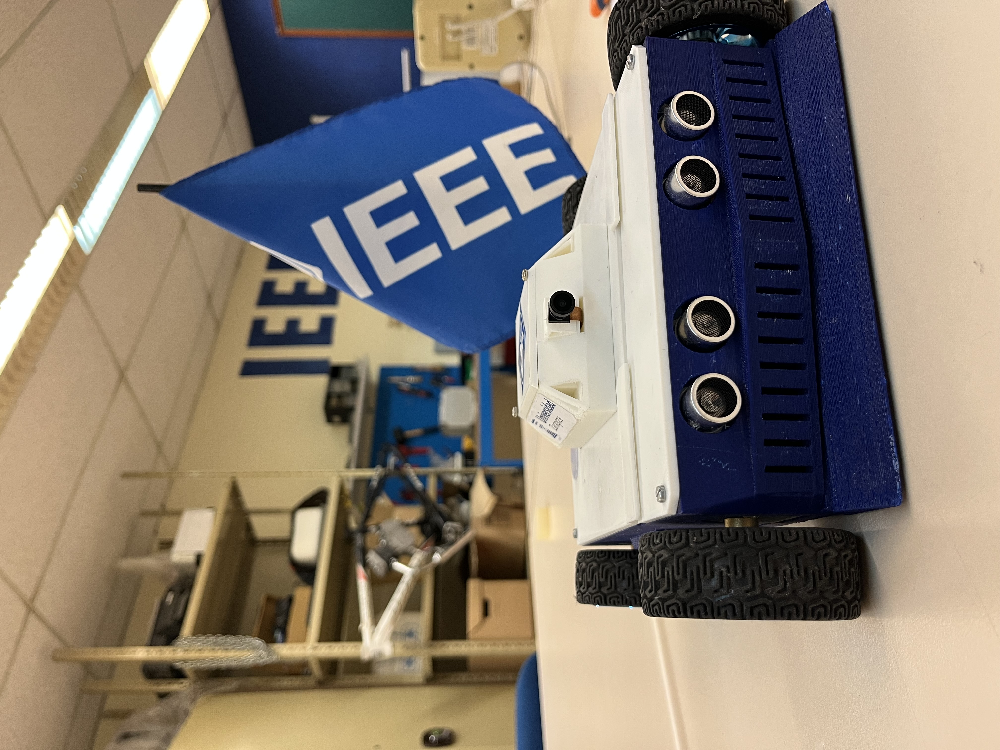
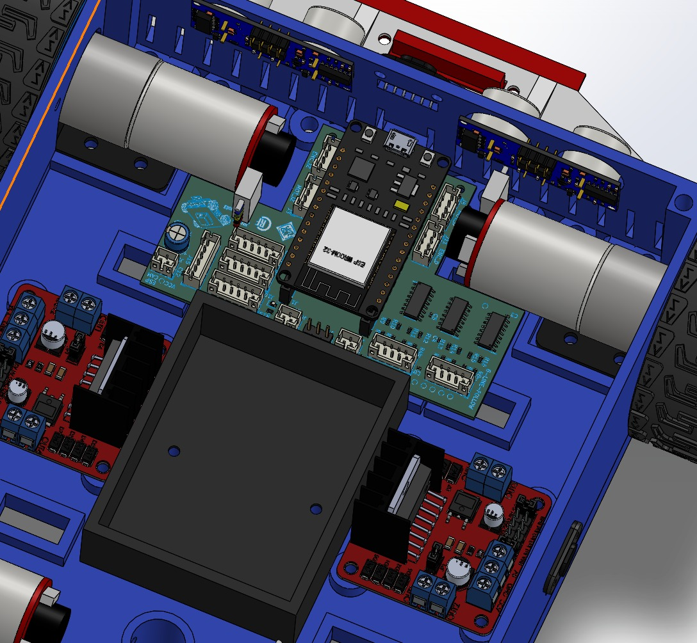
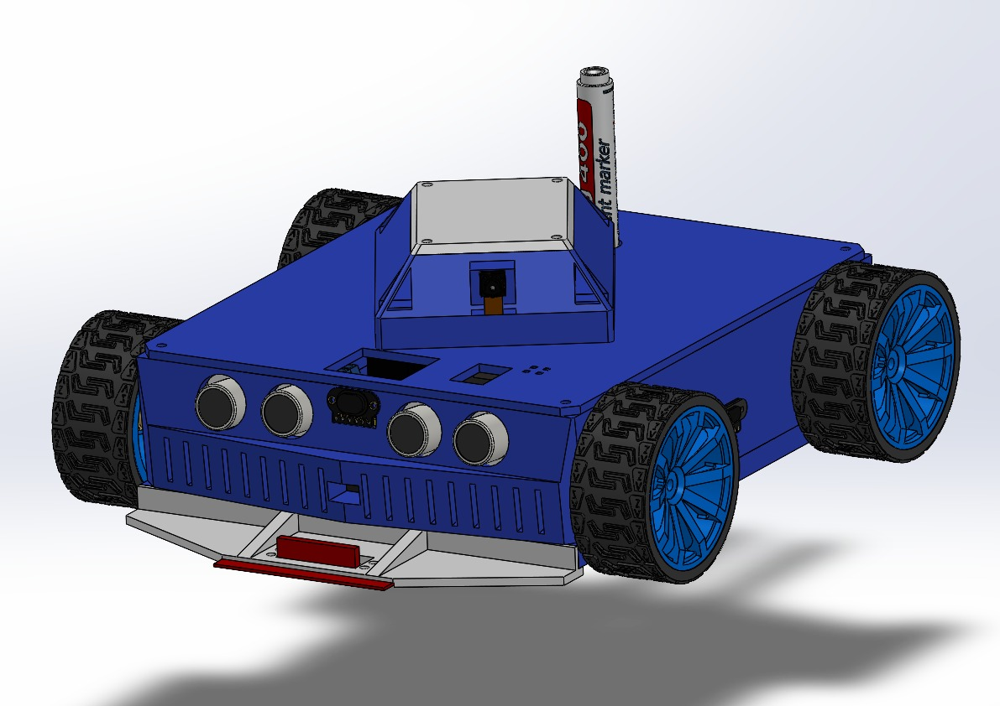
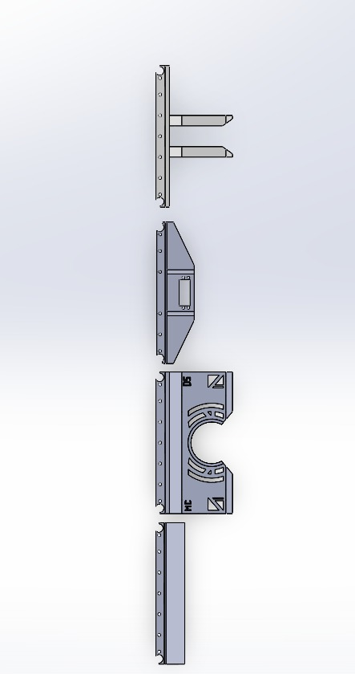
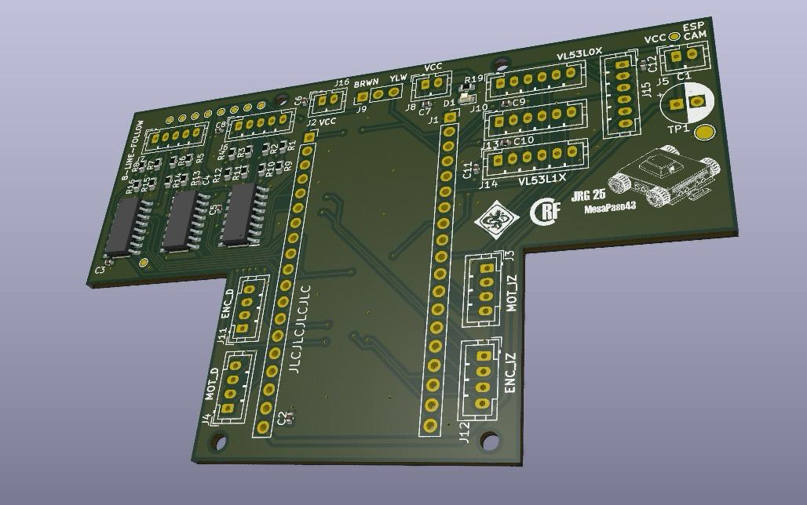
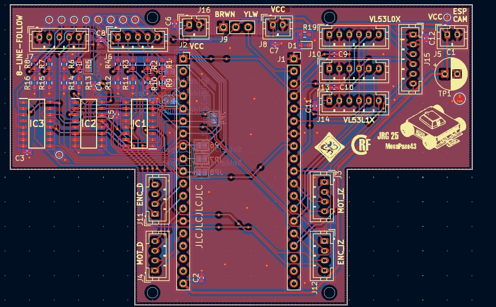
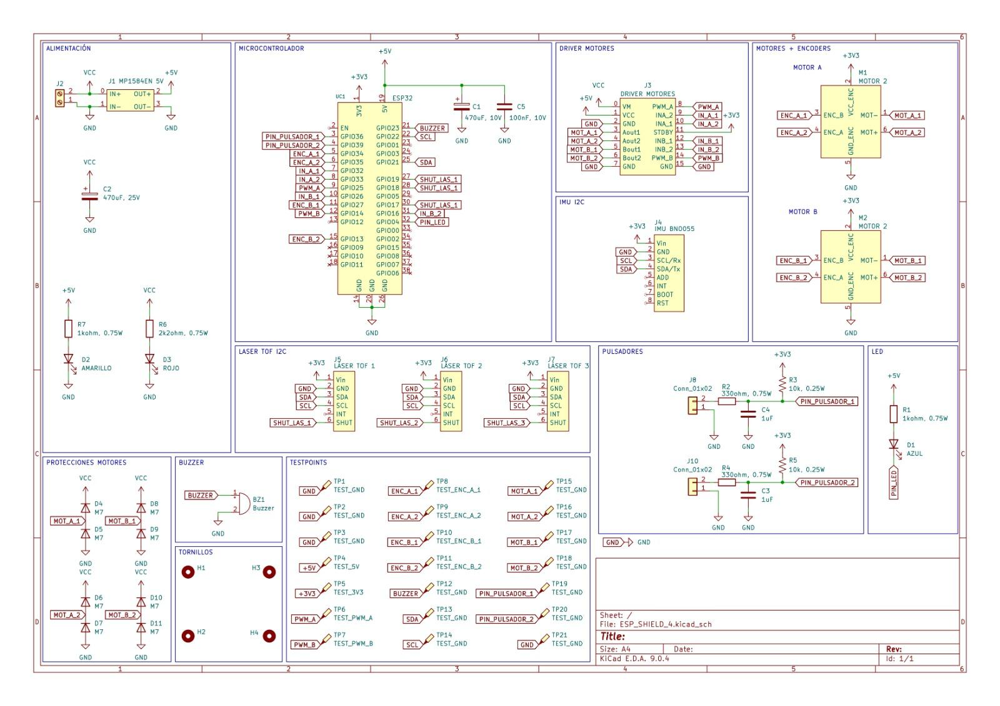
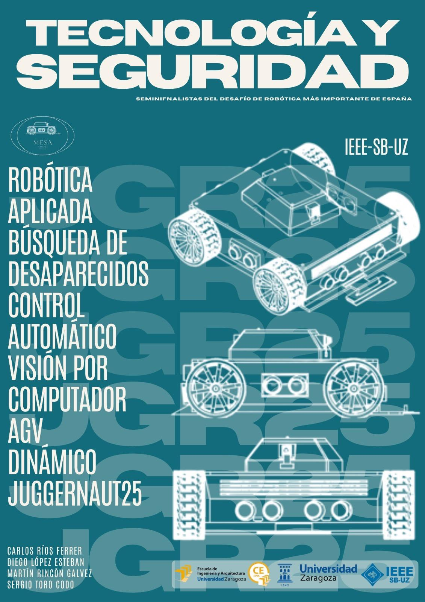

# JGR26

## 🇬🇧 Project Description (English)

**JGR26** is a fully custom **4-wheel robotic platform** designed and built entirely by our team from scratch. The project combines **mechanical design**, **custom electronics**, **embedded firmware**, **sensor integration**, and **remote control software** into a single robotics system.

The robot was completely modeled in **3D**, equipped with a **custom-designed PCB**, programmed around an **ESP32**, and expanded with multiple operation modes for different competitive and experimental scenarios.

JGR26 can be programmed to work in either **line-following mode** or **sumo mode**, while its mechanical chassis can also be configured in **high mode** (all-terrain configuration) or **low mode**, giving the platform both functional and structural versatility.

---

## Key Features

* **100% custom 4-wheel robot** fully developed by our team
* Full **3D mechanical design** of the robot structure
* **Custom PCB** designed specifically for the platform
* **ESP32-based embedded system**
* **Line-following mode** with **PID-based control**
* **Line-loss recovery algorithm**
* **Sumo mode** for competitive robot behavior
* Configurable chassis:
  * **High mode** for all-terrain configuration
  * **Low mode** for a more compact setup
* **TOF400C laser sensors** connected through **I²C**
* **ESP32-CAM** integration
* **Bluetooth remote control**
* Custom **desktop application** developed in **Python + Tkinter**
* In-house developed libraries for:
  * motor control
  * laser sensor reading
  * robot-specific low-level control
* Project posters and visual material also designed by the team

---

## Mechanical Design

The robot was fully designed in 3D with SolidWorks, including the chassis, structural components, and internal mounting system.  
The design focuses on a **highly modular architecture**, allowing the robot to be adapted for different challenges and configurations.

It includes the possibility of mounting a **pencil module** to draw figures, as well as dedicated modules for **sumo**, **line-following**, and **golf** tests.  
The robot also features a **low center of mass** to improve stability, while keeping all the electronics fully integrated inside the chassis for a cleaner and more protected design.

---

## Electronics

JGR26 includes a **custom PCB** developed for the robot’s electronics integration and is based on an **ESP32** as the main controller.

The motion system is driven using **L298N H-bridge motor drivers**, while the sensing system includes **TOF400C laser sensors via I²C** and an **ESP32-CAM** module for additional vision-related functionality.

## PCB 3D

## PCB LAYOUT

## PCB SCH

---

## Software and Control

The embedded software was specifically developed for this platform and includes autonomous as well as remote-control capabilities.

Main software features include:

* **PID line-following control**
* **Line-loss detection and recovery**
* **Sumo behavior programming**
* Custom motor-control libraries
* Custom laser-reading libraries
* Bluetooth communication with a PC application

The remote-control interface was developed in **Python** using **Tkinter**, allowing the robot to be controlled wirelessly from a computer through **Bluetooth**.

---

## Development Scope

This project involved the complete development of a robotics system, including:

* Mechanical design and CAD modeling
* PCB design
* Embedded programming
* Sensor integration
* Motion and behavior control
* Vision module integration
* Desktop control software
* Project presentation and poster design

---

## Image and Project Identity

JGR26 was not only developed as a technical robotics platform, but also presented as a complete project with its own visual identity and communication approach.

As part of the development, we worked on the **image and branding of the robot**, creating visual material to make the project more recognizable, understandable, and engaging for others. This included the design of **posters, presentation material, and promotional graphics** used to showcase the robot and explain its main features, operation modes, and design philosophy.

The goal of this effort was to communicate the project beyond its technical implementation, giving it a clearer identity and making it easier to present in academic, exhibition, and demonstration contexts.

This branding and outreach work helped reinforce JGR26 as a complete engineering project, combining not only **mechanical design, electronics, and control**, but also **visual communication and project presentation**.

---

## Team

This project was developed by:

* **Carlos Rios**
* **Martin Rincón**
* **Sergio Toro**
* **Diego López**

---

## Goal

The goal of **JGR26** was to develop a complete custom robotic platform capable of combining **electronics**, **mechanical design**, **embedded systems**, **control**, and **software integration** in a single project.

Beyond the final robot itself, the project also served as a practical engineering exercise in the full workflow of robotics development: from concept and design to implementation, testing, and validation.

---

## Repository Content

This repository may include:

* 3D models and CAD files
* PCB design files
* Schematics
* Embedded firmware
* Custom libraries
* Python desktop application
* Images of the robot
* Posters and project documentation
